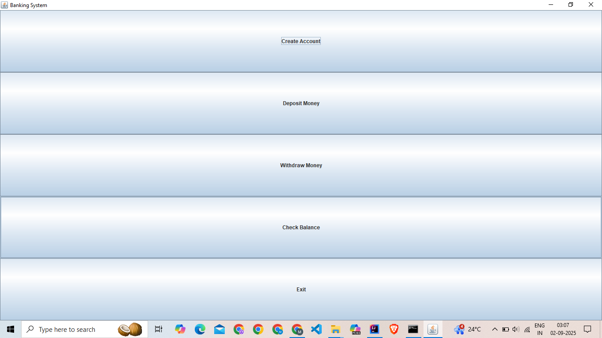

# Simple Banking System (Java Swing + MySQL)

A desktop **Banking System** built with **Java (Swing)** and **JDBC** over **MySQL**.  
Features include creating accounts, depositing/withdrawing, and checking balances.

## 🚀 Tech Stack
- Java 17+ (Swing for GUI)
- MySQL 8.x
- JDBC (mysql-connector-j)
- IntelliJ IDEA

## 📁 Project Structure
```
BankingSystemGUI/
 ├── README.md
 ├── LICENSE
 ├── .gitignore
 └── src/
      └── banking/
            ├── DBConnection.java
            ├── BankingGUI.java
            ├── CreateAccount.java
            ├── DepositMoney.java
            ├── WithdrawMoney.java
            └── CheckBalance.java
```

## ⚙️ How to Run
1. Clone this repository:
   ```bash
   git clone https://github.com/your-username/BankingSystemGUI.git
2. Import the project in IntelliJ IDEA.

3. Set up MySQL database:
```
   CREATE DATABASE banking_system;
   USE banking_system;
   CREATE TABLE accounts (
   account_id INT PRIMARY KEY AUTO_INCREMENT,
   name VARCHAR(100) NOT NULL,
   balance DECIMAL(10,2) NOT NULL
   );
```
4. Update DBConnection.java with your MySQL username and password.

5. Run BankingGUI.java.
##  ✅ Features
- Account Creation with auto-increment ID
- Deposit & Withdraw Money
- Check Account Balance
- GUI-based (Swing)

## 🔮 Future Enhancements

- Transaction History

- Delete Account

- Transfer Money between accounts
## 📷 Screenshots

## 📄 License
This project is licensed under the [MIT License](LICENSE).
